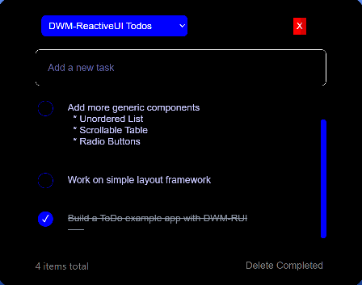

## TODO App

This simple app allows me to organize Todo-Tasks by subject and project.    
I've used a simple selectBox to select a project.    
Once selected, all tasks for that project are listed.    
Clicking on a task, allows you to edit the text in a multi-line TextArea element.    

Each task has a `completed` checkBox.    
When one or more tasks are `Checked`, a button on the bottom-right will delete them all.    

Note, the `Topic-Select-List` is configurable directly in the app. Just select `Todo App Topics`        
in the drop-down, and then click on the json-text to edit it. Changes will show on tab refresh.    

This version uses LocalStorage.  I'll be _Deploying a version for DenoKv. 
