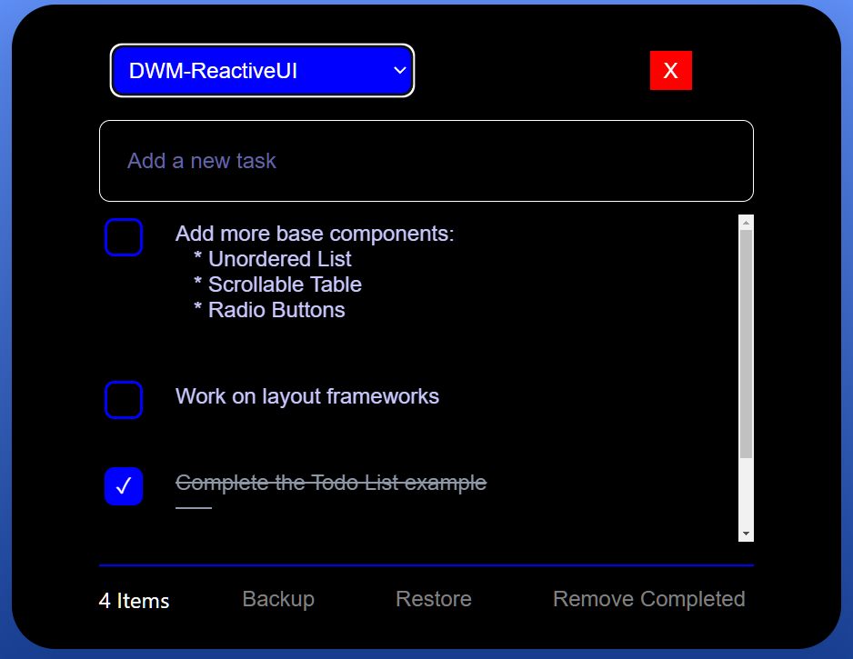

## TODO App

This simple app allows me to organize Todo-Tasks by subject and project.    
I've used a simple selectBox to select a project.    
Once selected, all tasks for that project are listed.    
Clicking on a task, allows you to edit the text in a multi-line TextArea element.    

### Try it:  https://nhrones.github.io/To-Do-List/

Each task has a `completed` checkBox.    
When one or more tasks are `Checked`, a button on the bottom-right will delete them all.    

 

## Todo Topics
Note, the `Topic-Select-List` is configurable directly in the app. Just select `Todo App Topics`        
in the drop-down, and then click on the json-text to edit it. Changes will show on tab refresh.   

This version uses localStorage.  I'll be _Deploying_ a version for DenoKv.    

If something breaks, you can delete the localStorage file, and a blank template will auto install on next start. See: ./selections.js/

I started this project as a DWM-ReactiveUI app.  I liked it so much, that I spent time    
creating this HTML version.  It was very difficult with my limited CSS experience to get   
the same look-and-feel as the deno-desktop version.

Have Fun